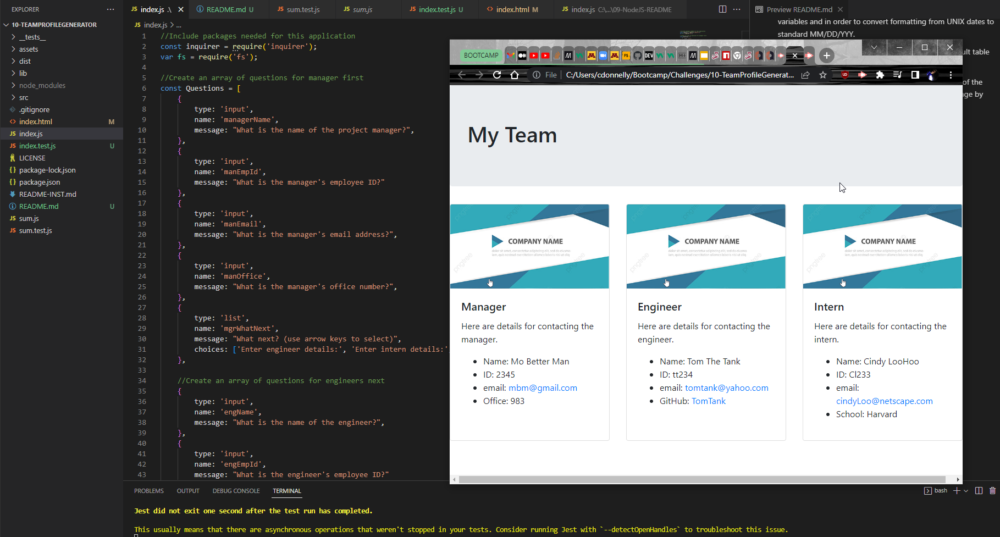

# 10 - Team Profile Generator?
# Submitted by Conor Donnelly - November 8, 2022

This challenge required us to write code from scratch using Node.js to build a team profile HTML page based on user input from the Inquirer module.

1st) Inquirer prompts user to enter contact details about a project manager

2nd) Inquirer prompts user to enter contact details about a project engineer

3rd) Inquirer prompts user to enter contact details about a project intern

After all details have been entered, we use the FS module to write an index.html page that displays details about the team members. This page was created using template literals in the index.js page.

## Screenshot

## Link to Screencastify Recording of Demo
Check it out! --> [Google Drive Link](https://drive.google.com/file/d/1iNoh9ri2cAcg8JXLb2-xXOsqtyVuQLZV/view).

